# Ottobon Jobs — Full Project Documentation

> **Outcome-Driven Recruitment Ecosystem** — connecting providers directly with seekers via AI-powered matching.

---

## Table of Contents

1. [Project Overview](#1-project-overview)
2. [Architecture & Design Patterns](#2-architecture--design-patterns)
3. [Technology Stack](#3-technology-stack)
4. [Backend (FastAPI)](#4-backend-fastapi)
   - [Entry Point & Middleware](#41-entry-point--middleware)
   - [Configuration](#42-configuration)
   - [Dependency Injection](#43-dependency-injection)
   - [Domain Models & Enums](#44-domain-models--enums)
   - [Routers (API Endpoints)](#45-routers-api-endpoints)
   - [Services (Business Logic)](#46-services-business-logic)
   - [Adapters (Concrete Implementations)](#47-adapters-concrete-implementations)
   - [Ports (Abstract Interfaces)](#48-ports-abstract-interfaces)
   - [Scrapers](#49-scrapers)
   - [Scheduler](#410-scheduler)
5. [Frontend (React + Vite)](#5-frontend-react--vite)
   - [App Structure & Routing](#51-app-structure--routing)
   - [Auth Context & Session](#52-auth-context--session)
   - [API Layer](#53-api-layer)
   - [Pages](#54-pages)
   - [Components](#55-components)
   - [Hooks](#56-hooks)
6. [Database Schema (Supabase / PostgreSQL)](#6-database-schema-supabase--postgresql)
7. [AI & Embedding Pipeline](#7-ai--embedding-pipeline)
8. [Job Ingestion Pipeline](#8-job-ingestion-pipeline)
9. [Enterprise Hardening](#9-enterprise-hardening)
10. [User Roles & Permissions](#10-user-roles--permissions)
11. [Environment Variables](#11-environment-variables)
12. [Running Locally](#12-running-locally)
13. [SQL Migrations](#13-sql-migrations)

---

## 1. Project Overview

**Ottobon Jobs** (branded as `jobs.ottobon.cloud`) is an AI-powered recruitment platform that:

- **Scrapes** entry-level/intern job listings from Big 4 career sites (Deloitte, PwC, KPMG, EY)
- **Enriches** each job with AI-generated interview prep questions and resume optimization tips
- **Matches** seekers to jobs using cosine similarity between resume and job vector embeddings
- **Connects** seekers to an AI Career Coach via real-time WebSocket chat
- **Empowers** admins to take over AI chats as human agents ("Control Tower")

### Three User Roles

| Role | Description |
|------|-------------|
| **Seeker** | Browses jobs, uploads resumes, runs AI match analysis, chats with Career Coach |
| **Provider** | Posts job listings manually, views their own listings |
| **Admin** | Triggers scrapers, takes over chat sessions, manages the Control Tower |

---

## 2. Architecture & Design Patterns

### Hexagonal (Ports & Adapters) Architecture

The backend follows a strict **Hexagonal Architecture**:

```
Routers (HTTP/WebSocket layer)
    └── Services (business logic — depends on Ports only)
          └── Ports (abstract interfaces — ABCs)
                └── Adapters (concrete implementations)
```

**Key principles enforced:**
- **Dependency Inversion**: Services depend only on abstract `Port` interfaces, never on concrete adapters
- **Open/Closed Principle**: Swapping providers (e.g., OpenAI → Ollama) requires changing only `dependencies.py`
- **Single Responsibility**: Each service handles one domain area; routers are thin HTTP wrappers

### Data Flow Diagram

```mermaid
graph TD
    subgraph Frontend ["Frontend (React 18 + Vite)"]
        A[AuthContext — Supabase Auth] --> B[API Client — Axios + JWT]
        B --> C[Pages & Components]
        C --> D[useWebSocket — Chat]
    end

    subgraph Backend ["Backend (FastAPI)"]
        E[Routers — REST + WebSocket] --> F[Services]
        F --> G[Ports — Abstract Interfaces]
        G --> H[Adapters — Concrete Impl]
        I[Scheduler — APScheduler] --> F
    end

    subgraph External ["External Services"]
        J[Supabase — PostgreSQL + Auth + Storage]
        K[OpenAI — GPT-4o-mini + Embeddings]
        L[Career Sites — Deloitte / PwC / KPMG / EY]
    end

    B -->|REST API| E
    D -->|WebSocket| E
    H --> J
    H --> K
    I -->|Cron 10PM IST| L
```



---

## 3. Technology Stack

### Backend
| Component | Technology |
|-----------|-----------|
| Framework | **FastAPI** (Python 3.12+) |
| Database | **Supabase** (PostgreSQL + pgvector) |
| Authentication | **Supabase Auth** (JWT) |
| File Storage | **Supabase Storage** (resume PDFs) |
| AI / LLM | **OpenAI GPT-4o-mini** via `instructor` (structured output) |
| Embeddings | **OpenAI text-embedding-3-small** (1536 dimensions) |
| PDF Parsing | **pypdf** (offloaded to threadpool via `asyncio.to_thread`) |
| DOCX Parsing | **python-docx** (offloaded to threadpool via `asyncio.to_thread`) |
| Scheduling | **APScheduler** (AsyncIO + distributed cron locks) |
| Web Scraping | **aiohttp** + custom HTML parsers per site |
| Config | **pydantic-settings** (typed `.env` loading) |
| Server | **Uvicorn** with hot-reload |

### Frontend
| Component | Technology |
|-----------|-----------|
| Framework | **React 18** with **Vite** |
| Routing | **React Router v6** |
| HTTP Client | **Axios** with interceptors (auto-retry 503s) |
| Auth | **Supabase JS SDK** (`@supabase/supabase-js`) |
| Icons | **Lucide React** |
| Styling | **Tailwind CSS v4** + CSS custom properties |
| State | **React Context** (memoized with `useMemo`) |

---

## 4. Backend (FastAPI)

### 4.1 Entry Point & Middleware

**File:** [main.py](file:///c:/Users/adity/Desktop/Ottobon/Jobs/backend/main.py)

```python
app = FastAPI(
    title="jobs.ottobon.cloud",
    description="Outcome-Driven Recruitment Ecosystem",
    version="0.1.0",
    lifespan=lifespan,     # starts/stops APScheduler
)
```

- **CORS**: `allow_origins=["*"]` (development); should be tightened in production
- **Lifespan**: Starts APScheduler on startup, shuts it down on exit
- **Routers registered**: `users`, `jobs`, `matching`, `chat`, `admin`, `ingestion`
- **Health check**: `GET /` → `{"status": "ok", "service": "jobs.ottobon.cloud"}`

---

### 4.2 Configuration

**File:** [config.py](file:///c:/Users/adity/Desktop/Ottobon/Jobs/backend/app/config.py)

Uses `pydantic-settings` for typed, validated environment config from `.env`:

| Setting | Type | Description |
|---------|------|-------------|
| `supabase_url` | `str` | Supabase project URL |
| `supabase_key` | `str` | Anon key (client-facing) |
| `supabase_service_role_key` | `str` | Service role key (bypasses RLS) |
| `supabase_jwt_secret` | `str` | JWT signing secret |
| `openai_api_key` | `str` | OpenAI API key |
| `app_name` | `str` | Default: `"jobs.ottobon.cloud"` |
| `debug` | `bool` | Default: `False` |

---

### 4.3 Dependency Injection

**File:** [dependencies.py](file:///c:/Users/adity/Desktop/Ottobon/Jobs/backend/app/dependencies.py)

Central DI container that wires abstract Ports to concrete Adapters using `@lru_cache` singletons:

| Dependency Function | Port (Interface) | Adapter (Implementation) |
|---------------------|-------------------|--------------------------|
| `get_db()` | `DatabasePort` | `SupabaseAdapter` |
| `get_ai_service()` | `AIPort` | `OpenAIAdapter` |
| `get_embedding_service()` | `EmbeddingPort` | `OpenAIEmbeddingAdapter` |
| `get_storage()` | `StoragePort` | `SupabaseStorageAdapter` |
| `get_document_parser()` | `DocumentPort` | `DocumentAdapter` |

**Scraper Registry:**

```python
_SCRAPER_REGISTRY = {
    "deloitte": DeloitteAdapter,
    "pwc":      PwCAdapter,
    "kpmg":     KPMGAdapter,
    "ey":       EYAdapter,
}
```

`get_scraper(name)` resolves a source name to its adapter, `get_all_scrapers()` returns all.

---

### 4.4 Domain Models & Enums

**Files:** [models.py](file:///c:/Users/adity/Desktop/Ottobon/Jobs/backend/app/domain/models.py), [enums.py](file:///c:/Users/adity/Desktop/Ottobon/Jobs/backend/app/domain/enums.py)

All Pydantic models are **pure data** — no I/O, no side effects.

| Model | Purpose |
|-------|---------|
| `UserProfile` | Response for `GET /users/me` — id, email, role, resume info |
| `ResumeUploadResponse` | Confirms resume upload with character count |
| `ResumeDownloadResponse` | Returns a signed download URL |
| `JobCreate` | Request body for creating a job (title ≥ 3 chars, description ≥ 20 chars, skills list) |
| `JobDetail` | Full job with AI-generated `prep_guide_generated` and `resume_guide_generated` |
| `JobFeedItem` | Lightweight job listing (no description/guides) for the feed |
| `JobCreateResponse` | `id` + "enrichment processing in background" message |
| `MatchResult` | `similarity_score` (0.0–1.0) + `gap_detected` boolean |
| `AIEnrichment` | Structured AI output: exactly 5 resume tips + 5 prep questions |
| `ChatMessage` | Single message: `role` (user/assistant/admin), `content`, `timestamp` |
| `ChatSessionInfo` | Session metadata: id, user_id, status, created_at |
| `TakeoverRequest` | Admin takeover: `session_id` |

**Enums:**
- `UserRole`: `seeker`, `provider`, `admin`
- `ChatStatus`: `active_ai`, `active_human`, `closed`

---

### 4.5 Routers (API Endpoints)

#### Users Router — [users.py](file:///c:/Users/adity/Desktop/Ottobon/Jobs/backend/app/routers/users.py)

| Method | Endpoint | Auth | Description |
|--------|----------|------|-------------|
| `GET` | `/users/me` | ✅ | Get authenticated user's profile |
| `POST` | `/users/resume` | ✅ | Upload PDF/DOCX → store in Supabase Storage → extract text → embed → save |
| `GET` | `/users/me/resume` | ✅ | Get a fresh 15-minute signed download URL |

Allowed extensions: `.pdf`, `.docx`. Validates file is non-empty and text-extractable.

---

#### Jobs Router — [jobs.py](file:///c:/Users/adity/Desktop/Ottobon/Jobs/backend/app/routers/jobs.py)

| Method | Endpoint | Auth | Description |
|--------|----------|------|-------------|
| `POST` | `/jobs` | ✅ Provider | Create a job; triggers AI enrichment as BackgroundTask |
| `GET` | `/jobs/provider` | ✅ Provider | List all jobs by the logged-in provider |
| `GET` | `/jobs/feed` | ❌ Public | Paginated job feed (`skip`, `limit` params) |
| `GET` | `/jobs/{id}/details` | ❌ Public | Full job detail with AI-generated guides |

---

#### Matching Router — [matching.py](file:///c:/Users/adity/Desktop/Ottobon/Jobs/backend/app/routers/matching.py)

| Method | Endpoint | Auth | Description |
|--------|----------|------|-------------|
| `POST` | `/jobs/{id}/match` | ✅ Seeker | Cosine similarity: user resume embedding vs. job embedding |

Returns: `{ job_id, similarity_score: 0.72, gap_detected: false }`
Gap threshold: `0.7` (score < 0.7 = gap detected)

---

#### Chat Router — [chat.py](file:///c:/Users/adity/Desktop/Ottobon/Jobs/backend/app/routers/chat.py)

| Method | Endpoint | Auth | Description |
|--------|----------|------|-------------|
| `POST` | `/chat/sessions` | ✅ | Create new chat session |
| `GET` | `/chat/sessions/{id}` | ✅ | Get session info |
| `WS` | `/ws/chat/{session_id}` | — | Real-time chat WebSocket |

**WebSocket flow:**
1. Validate session exists and isn't closed
2. Replay last 10 messages (state recovery on reconnect)
3. Enter message loop:
   - **AI mode** (`active_ai`): Auto-respond with personalized career advice using user's resume context
   - **Human mode** (`active_human`): Queue message, acknowledge to user, admin responds separately

**ConnectionManager:** In-memory dict of active WebSocket connections keyed by `session_id`. (Production note: replace with Redis Pub/Sub for horizontal scaling.)

---

#### Admin Router — [admin.py](file:///c:/Users/adity/Desktop/Ottobon/Jobs/backend/app/routers/admin.py)

| Method | Endpoint | Auth | Description |
|--------|----------|------|-------------|
| `POST` | `/admin/takeover` | ✅ Admin | Switch chat session from AI → human mode |
| `POST` | `/admin/ingest/trigger` | ✅ Admin/Provider | Manually trigger scraping |
| `POST` | `/admin/reenrich` | ❌ (Dev only) | Re-run AI enrichment for all unenriched jobs (batched: 3 at a time, 3s delay) |

---

#### Ingestion Router — [ingestion.py](file:///c:/Users/adity/Desktop/Ottobon/Jobs/backend/app/routers/ingestion.py)

| Method | Endpoint | Auth | Description |
|--------|----------|------|-------------|
| `POST` | `/admin/ingest` | ✅ Admin/Provider | Trigger ingestion for a specific scraper or all |

---

### 4.6 Services (Business Logic)

Each service depends only on Port interfaces — never on concrete adapters.

#### AuthService — [auth_service.py](file:///c:/Users/adity/Desktop/Ottobon/Jobs/backend/app/services/auth_service.py)
- Validates Supabase JWT tokens from the `Authorization: Bearer <token>` header
- Auto-provisions new users in the database on first login
- Returns the full user record as `current_user` FastAPI dependency

#### JobService — [job_service.py](file:///c:/Users/adity/Desktop/Ottobon/Jobs/backend/app/services/job_service.py)
- `create_job()` → insert record, return created job
- `get_job()` → fetch by ID
- `list_jobs_by_provider()` → fetch all for a provider

#### EnrichmentService — [enrichment_service.py](file:///c:/Users/adity/Desktop/Ottobon/Jobs/backend/app/services/enrichment_service.py)

Orchestrates the AI enrichment pipeline for each job:

```
1. Fetch job record from DB
2. Call OpenAI → 5 resume optimization tips + 5 interview prep questions
   (structured output via `instructor` library)
3. Generate 1536-dimension embedding of job description
4. Save guides + embedding to job record, set status = 'active'
```

Also has a `enrich_jobs_batch()` stub for future OpenAI Batch API integration (~50% cost savings).

#### MatchingService — [matching_service.py](file:///c:/Users/adity/Desktop/Ottobon/Jobs/backend/app/services/matching_service.py)
- `calculate_match(user_id, job_id)`:
  1. Fetch user's `resume_embedding` + job's `embedding`
  2. Parse vectors (Supabase may return pgvector strings)
  3. Compute cosine similarity in Python
  4. Return `MatchResult` with score and gap flag (threshold: `0.7`)

#### ChatService — [chat_service.py](file:///c:/Users/adity/Desktop/Ottobon/Jobs/backend/app/services/chat_service.py)

State machine routing messages between AI and human agents:

- `handle_message(session_id, text)`:
  - **AI mode**: Builds personalized context from user's resume (truncated to ~2000 chars) → calls OpenAI `chat()` → appends both messages to conversation log
  - **Human mode**: Saves user message only; returns `None` (admin responds via `admin_reply()`)
- `_build_user_context()` → rich system prompt with candidate name, resume content, and instructions for personalized advice
- `get_recent_history(count=10)` → WebSocket reconnect state recovery
- `takeover()` → switch session from `active_ai` to `active_human`
- `admin_reply()` → admin pushes a message directly into conversation log

#### UserService — [user_service.py](file:///c:/Users/adity/Desktop/Ottobon/Jobs/backend/app/services/user_service.py)

Full resume processing pipeline:

```
1. Sanitize filename → generate unique storage path
2. Upload original file to Supabase Storage ("resumes" bucket)
3. Extract text (PDF via pypdf, DOCX via python-docx) — offloaded to threadpool
4. Generate embedding (OpenAI text-embedding-3-small)
5. Store file_url, text, and embedding in user record
```

Also: `get_resume_download_url()` → generates 15-minute signed URL (never cached).

#### IngestionService — [ingestion_service.py](file:///c:/Users/adity/Desktop/Ottobon/Jobs/backend/app/services/ingestion_service.py)

Full scrape → dedup → insert → enrich pipeline with resilience:

```
1. Create scraping_log entry (status: 'running')
2. Fetch jobs from external scraper (fail-fast per scraper)
3. Deduplicate by (company_name, external_id) — skip if exists
4. SHA-256 hash dedup — if identical description already enriched,
   copy AI data instead of re-calling OpenAI (cost savings)
5. Insert new jobs → trigger enrichment → set status = 'active'
6. Finalize scraping_log with stats: {fetched, new, skipped, errors, dedup_hits}
```

System ingestion user: `INGESTION_PROVIDER_ID = "00000000-0000-4000-a000-000000000001"`

---

### 4.7 Adapters (Concrete Implementations)

| Adapter | Port | Service | Key Methods |
|---------|------|---------|-------------|
| [SupabaseAdapter](file:///c:/Users/adity/Desktop/Ottobon/Jobs/backend/app/adapters/supabase_adapter.py) | `DatabasePort` | Supabase PostgreSQL | CRUD for users, jobs, chat sessions, scraping logs. Dedup lookups by external_id and description_hash |
| [OpenAIAdapter](file:///c:/Users/adity/Desktop/Ottobon/Jobs/backend/app/adapters/openai_adapter.py) | `AIPort` | OpenAI GPT-4o-mini | `generate_enrichment()` (structured via instructor), `chat()` (conversational) |
| [OpenAIEmbeddingAdapter](file:///c:/Users/adity/Desktop/Ottobon/Jobs/backend/app/adapters/openai_embedding.py) | `EmbeddingPort` | OpenAI Embeddings | `encode(text)` → 1536-dim float vector |
| [SupabaseStorageAdapter](file:///c:/Users/adity/Desktop/Ottobon/Jobs/backend/app/adapters/supabase_storage_adapter.py) | `StoragePort` | Supabase Storage | `upload_file()`, `get_signed_url(expires=900)` |
| [DocumentAdapter](file:///c:/Users/adity/Desktop/Ottobon/Jobs/backend/app/adapters/document_adapter.py) | `DocumentPort` | Local (pypdf + docx) | `extract_text(bytes, ext)` — **offloaded to threadpool via `asyncio.to_thread()`** |

---

### 4.8 Ports (Abstract Interfaces)

All ports are Python `ABC` classes with `@abstractmethod` declarations.

| Port | File | Methods |
|------|------|---------|
| `DatabasePort` | [database_port.py](file:///c:/Users/adity/Desktop/Ottobon/Jobs/backend/app/ports/database_port.py) | `get_user`, `upsert_user`, `create_job`, `get_job`, `update_job`, `list_jobs_by_provider`, `find_job_by_external_id`, `find_job_by_description_hash`, `list_active_jobs`, `get_chat_session`, `update_chat_session`, `create_chat_session`, `insert_scraping_log`, `update_scraping_log` |
| `AIPort` | [ai_port.py](file:///c:/Users/adity/Desktop/Ottobon/Jobs/backend/app/ports/ai_port.py) | `generate_enrichment(description, skills)`, `chat(messages, user_context)` |
| `EmbeddingPort` | [embedding_port.py](file:///c:/Users/adity/Desktop/Ottobon/Jobs/backend/app/ports/embedding_port.py) | `encode(text)` → `list[float]` |
| `StoragePort` | [storage_port.py](file:///c:/Users/adity/Desktop/Ottobon/Jobs/backend/app/ports/storage_port.py) | `upload_file(bucket, path, bytes, content_type)`, `get_signed_url(bucket, path, expires_in)` |
| `DocumentPort` | [document_port.py](file:///c:/Users/adity/Desktop/Ottobon/Jobs/backend/app/ports/document_port.py) | `extract_text(file_bytes, file_extension)`, `supported_extensions()` |
| `PdfPort` | [pdf_port.py](file:///c:/Users/adity/Desktop/Ottobon/Jobs/backend/app/ports/pdf_port.py) | `extract_text(file_bytes)` |

---

### 4.9 Scrapers

All scrapers implement the `ScraperPort` interface with a `fetch_jobs()` → `list[dict]` method.

| Scraper | File | Target | Method |
|---------|------|--------|--------|
| **Deloitte** | [deloitte_adapter.py](file:///c:/Users/adity/Desktop/Ottobon/Jobs/backend/app/scraper/deloitte_adapter.py) | Deloitte India Careers | HTML parsing + experience filter |
| **PwC** | [pwc_adapter.py](file:///c:/Users/adity/Desktop/Ottobon/Jobs/backend/app/scraper/pwc_adapter.py) | PwC India Careers | HTML parsing |
| **KPMG** | [kpmg_adapter.py](file:///c:/Users/adity/Desktop/Ottobon/Jobs/backend/app/scraper/kpmg_adapter.py) | KPMG India Careers | API-based |
| **EY** | [ey_adapter.py](file:///c:/Users/adity/Desktop/Ottobon/Jobs/backend/app/scraper/ey_adapter.py) | EY India Careers | HTML parsing |

**Shared infrastructure:**
- [base_scraper.py](file:///c:/Users/adity/Desktop/Ottobon/Jobs/backend/app/scraper/base_scraper.py) — aiohttp session management, error handling
- [experience_filter.py](file:///c:/Users/adity/Desktop/Ottobon/Jobs/backend/app/scraper/experience_filter.py) — filters to entry-level/intern positions only
- [scraper_port.py](file:///c:/Users/adity/Desktop/Ottobon/Jobs/backend/app/scraper/scraper_port.py) — abstract interface

---

### 4.10 Scheduler

**File:** [scheduler.py](file:///c:/Users/adity/Desktop/Ottobon/Jobs/backend/app/scheduler.py)

- **APScheduler AsyncIOScheduler** with a CronTrigger
- **Schedule**: Daily at **10:00 PM IST** (Asia/Kolkata)
- **Distributed Cron Lock**: Before executing, acquires a Supabase-backed lock (`cron_locks` table) to prevent duplicate runs across multiple Uvicorn workers. Lock TTL = 30 minutes (crash recovery)
- Falls back to no-lock mode if migration hasn't been applied (backward compatible)

---

## 5. Frontend (React + Vite)

### 5.1 App Structure & Routing

**File:** [App.jsx](file:///c:/Users/adity/Desktop/Ottobon/Jobs/Frontend/src/App.jsx)

```
BrowserRouter
  └── AuthProvider (context — memoized)
        └── Routes
              ├── /login          → LoginPage (public)
              ├── /register       → RegisterPage (public)
              │
              └── AppShell (layout: Navbar + Sidebar + content)
                    ├── /jobs           → JobFeedPage (public)
                    ├── /jobs/:id       → JobDetailPage (public)
                    │
                    ├── 🔒 Seeker Only:
                    │   ├── /jobs/:id/match → MatchPage
                    │   ├── /profile        → ProfilePage
                    │   └── /chat           → ChatPage
                    │
                    ├── 🔒 Provider Only:
                    │   ├── /provider/create   → CreateJobPage
                    │   └── /provider/listings → MyListingsPage
                    │
                    └── 🔒 Admin Only:
                        ├── /admin/tower  → ControlTowerPage
                        └── /admin/ingest → IngestionPage
```

[ProtectedRoute.jsx](file:///c:/Users/adity/Desktop/Ottobon/Jobs/Frontend/src/components/ProtectedRoute.jsx) guards routes by `allowedRoles` array; redirects unauthenticated users to `/login`.

---

### 5.2 Auth Context & Session

**File:** [AuthContext.jsx](file:///c:/Users/adity/Desktop/Ottobon/Jobs/Frontend/src/context/AuthContext.jsx)

- Wraps the entire app; provides `user`, `session`, `role`, `loading`, `isAuthenticated`
- On mount: `supabase.auth.getSession()` + `onAuthStateChange` listener
- Race condition guard: `useRef(initialised)` prevents duplicate event processing
- **503 retry**: `fetchRole()` retries up to 2× on transient server overload
- **Memoized value**: `useMemo()` prevents unnecessary re-renders when unrelated state changes
- **Architectural rule**: High-frequency state (typing indicators, presence) should use a separate `ChatContext`, NOT this auth context

---

### 5.3 API Layer

**Base client:** [client.js](file:///c:/Users/adity/Desktop/Ottobon/Jobs/Frontend/src/api/client.js)
- Axios instance with `baseURL = VITE_API_BASE_URL`
- **Request interceptor**: Attaches Supabase JWT to every request
- **Response interceptor**: Auto-retries 503 errors up to 3× with linear backoff (1s, 2s, 3s)
- Exports both the Axios client and the Supabase client

| Module | File | Functions |
|--------|------|-----------|
| Jobs | [jobsApi.js](file:///c:/Users/adity/Desktop/Ottobon/Jobs/Frontend/src/api/jobsApi.js) | `createJob()`, `getProviderJobs()`, `getJobFeed(skip, limit)`, `getJobDetails(id)` |
| Users | [usersApi.js](file:///c:/Users/adity/Desktop/Ottobon/Jobs/Frontend/src/api/usersApi.js) | `getMyProfile()`, `uploadResume(file)` |
| Matching | [matchingApi.js](file:///c:/Users/adity/Desktop/Ottobon/Jobs/Frontend/src/api/matchingApi.js) | `matchJob(jobId)` |
| Chat | [chatApi.js](file:///c:/Users/adity/Desktop/Ottobon/Jobs/Frontend/src/api/chatApi.js) | `createChatSession()`, `getChatSession(id)` |
| Auth | [authApi.js](file:///c:/Users/adity/Desktop/Ottobon/Jobs/Frontend/src/api/authApi.js) | `loginUser(email, pw)`, `registerUser(email, pw, role)`, `logoutUser()` |
| Admin | [adminApi.js](file:///c:/Users/adity/Desktop/Ottobon/Jobs/Frontend/src/api/adminApi.js) | `triggerIngestion(source)` |

---

### 5.4 Pages

#### Auth Pages
| Page | File | Description |
|------|------|-------------|
| **LoginPage** | [LoginPage.jsx](file:///c:/Users/adity/Desktop/Ottobon/Jobs/Frontend/src/pages/auth/LoginPage.jsx) | Email/password login via Supabase Auth |
| **RegisterPage** | [RegisterPage.jsx](file:///c:/Users/adity/Desktop/Ottobon/Jobs/Frontend/src/pages/auth/RegisterPage.jsx) | Registration with role selection (Seeker / Provider) |

#### Seeker Pages
| Page | File | Description |
|------|------|-------------|
| **JobFeedPage** | [JobFeedPage.jsx](file:///c:/Users/adity/Desktop/Ottobon/Jobs/Frontend/src/pages/seeker/JobFeedPage.jsx) | Grid of job cards with live search (title, company, skills). Fetches first 50 jobs |
| **JobDetailPage** | [JobDetailPage.jsx](file:///c:/Users/adity/Desktop/Ottobon/Jobs/Frontend/src/pages/seeker/JobDetailPage.jsx) | Full job detail with 4-pillar layout: description, skills, interview prep, resume tips. "Check Again" button if AI enrichment not yet complete |
| **MatchPage** | [MatchPage.jsx](file:///c:/Users/adity/Desktop/Ottobon/Jobs/Frontend/src/pages/seeker/MatchPage.jsx) | Resume upload → match analysis. Score gauge (0–100%), gap detection badge, "Talk to Career Coach" or "Apply Now" actions |
| **ProfilePage** | [ProfilePage.jsx](file:///c:/Users/adity/Desktop/Ottobon/Jobs/Frontend/src/pages/seeker/ProfilePage.jsx) | User avatar (email initial), resume upload zone, resume status indicator |
| **ChatPage** | [ChatPage.jsx](file:///c:/Users/adity/Desktop/Ottobon/Jobs/Frontend/src/pages/chat/ChatPage.jsx) | Real-time chat with AI Career Coach via WebSocket. Supports user/assistant/admin/system message types with visual differentiation |

#### Provider Pages
| Page | File | Description |
|------|------|-------------|
| **CreateJobPage** | [CreateJobPage.jsx](file:///c:/Users/adity/Desktop/Ottobon/Jobs/Frontend/src/pages/provider/CreateJobPage.jsx) | Form: title, description, skills → `POST /jobs` |
| **MyListingsPage** | [MyListingsPage.jsx](file:///c:/Users/adity/Desktop/Ottobon/Jobs/Frontend/src/pages/provider/MyListingsPage.jsx) | Provider's own job listings with status |

#### Admin Pages
| Page | File | Description |
|------|------|-------------|
| **ControlTowerPage** | [ControlTowerPage.jsx](file:///c:/Users/adity/Desktop/Ottobon/Jobs/Frontend/src/pages/admin/ControlTowerPage.jsx) | Dashboard for managing active chat sessions; admin takeover |
| **IngestionPage** | [IngestionPage.jsx](file:///c:/Users/adity/Desktop/Ottobon/Jobs/Frontend/src/pages/admin/IngestionPage.jsx) | Brand-colored cards for each scraper (Deloitte, PwC, KPMG, EY) + "Sync All" button. Shows results JSON on completion |

---

### 5.5 Components

#### Layout
| Component | File | Description |
|-----------|------|-------------|
| **AppShell** | [AppShell.jsx](file:///c:/Users/adity/Desktop/Ottobon/Jobs/Frontend/src/components/Layout/AppShell.jsx) | Main layout: Navbar + Sidebar + `<Outlet>` content |
| **Navbar** | [Navbar.jsx](file:///c:/Users/adity/Desktop/Ottobon/Jobs/Frontend/src/components/Layout/Navbar.jsx) | Top bar with branding, user dropdown, role-aware menu |
| **Sidebar** | [Sidebar.jsx](file:///c:/Users/adity/Desktop/Ottobon/Jobs/Frontend/src/components/Layout/Sidebar.jsx) | Side navigation with role-based links |

#### UI
| Component | File | Description |
|-----------|------|-------------|
| **Button** | [Button.jsx](file:///c:/Users/adity/Desktop/Ottobon/Jobs/Frontend/src/components/ui/Button.jsx) | Variants: `primary` (accent bg), `secondary`, `ghost`, `danger`. Sizes: `sm`/`md`/`lg`. Loading spinner via Lucide `Loader2` |
| **Card** | [Card.jsx](file:///c:/Users/adity/Desktop/Ottobon/Jobs/Frontend/src/components/ui/Card.jsx) | Glass-panel card with optional hover effect |
| **Badge** | [Badge.jsx](file:///c:/Users/adity/Desktop/Ottobon/Jobs/Frontend/src/components/ui/Badge.jsx) | Skill/tag label pill |
| **Loader** | [Loader.jsx](file:///c:/Users/adity/Desktop/Ottobon/Jobs/Frontend/src/components/ui/Loader.jsx) | Spinner with `fullScreen` mode |
| **ScoreGauge** | [ScoreGauge.jsx](file:///c:/Users/adity/Desktop/Ottobon/Jobs/Frontend/src/components/ui/ScoreGauge.jsx) | Circular gauge for match score visualization |

---

### 5.6 Hooks

| Hook | File | Description |
|------|------|-------------|
| **useAuth** | [useAuth.js](file:///c:/Users/adity/Desktop/Ottobon/Jobs/Frontend/src/hooks/useAuth.js) | Consumes `AuthContext` — provides `user`, `role`, `session`, `loading`, `isAuthenticated` |
| **useWebSocket** | [useWebSocket.js](file:///c:/Users/adity/Desktop/Ottobon/Jobs/Frontend/src/hooks/useWebSocket.js) | WebSocket management: connect, history replay, optimistic message sending, **30-second ping/pong heartbeat** (prevents load balancer idle drops), cleanup on unmount |

---

## 6. Database Schema (Supabase / PostgreSQL)

**Base schema:** [schema.sql](file:///c:/Users/adity/Desktop/Ottobon/Jobs/backend/schema.sql)

### `users` Table
| Column | Type | Description |
|--------|------|-------------|
| `id` | `UUID` PK | Matches Supabase Auth user ID (`auth.uid()`) |
| `email` | `TEXT UNIQUE` | User's email |
| `role` | `user_role` enum | `seeker` / `provider` / `admin` |
| `full_name` | `TEXT` | Optional display name |
| `resume_text` | `TEXT` | Extracted plain text from uploaded resume |
| `resume_embedding` | `vector(1536)` | OpenAI embedding vector |
| `resume_file_url` | `TEXT` | Path in Supabase Storage |
| `resume_file_name` | `TEXT` | Original filename |
| `created_at` | `TIMESTAMPTZ` | Default `now()` |

### `jobs` Table
| Column | Type | Description |
|--------|------|-------------|
| `id` | `UUID` PK | Default `gen_random_uuid()` |
| `provider_id` | `UUID` FK → users | Creator/owner |
| `title` | `TEXT NOT NULL` | Job title |
| `description_raw` | `TEXT NOT NULL` | Full description |
| `skills_required` | `JSONB` | Array of required skills |
| `resume_guide_generated` | `JSONB` | 5 AI resume tips |
| `prep_guide_generated` | `JSONB` | 5 AI interview questions |
| `embedding` | `vector(1536)` | Job description embedding |
| `status` | `TEXT` | `processing` → `active` |
| `company_name` | `TEXT` | For scraped jobs |
| `external_id` | `TEXT` | Dedup key from external source |
| `external_apply_url` | `TEXT` | Link to original application |
| `description_hash` | `TEXT` | SHA-256 hash for AI cost dedup |
| `created_at` | `TIMESTAMPTZ` | Default `now()` |

**RLS Policies (via [005_rls_policies.sql](file:///c:/Users/adity/Desktop/Ottobon/Jobs/backend/migrations/005_rls_policies.sql)):**
- `seeker_read_active_jobs`: Any authenticated user can `SELECT` where `status = 'active'`
- `provider_manage_own_jobs`: `ALL` where `auth.uid() = provider_id`

### `chat_sessions` Table
| Column | Type | Description |
|--------|------|-------------|
| `id` | `UUID` PK | Default `gen_random_uuid()` |
| `user_id` | `UUID` FK → users | The seeker |
| `status` | `chat_status` enum | `active_ai` / `active_human` / `closed` |
| `conversation_log` | `JSONB` | Array of `{role, content, timestamp}` objects |
| `created_at` | `TIMESTAMPTZ` | Default `now()` |

### `scraping_logs` Table
| Column | Type | Description |
|--------|------|-------------|
| `id` | `UUID` PK | Auto-generated |
| `source_name` | `TEXT` | `deloitte` / `pwc` / `kpmg` / `ey` |
| `status` | `TEXT` | `running` / `success` / `partial` / `failed` |
| `jobs_found` | `INT` | Total scraped |
| `jobs_new` | `INT` | New insertions |
| `jobs_skipped` | `INT` | Duplicates skipped |
| `error_count` | `INT` | Failed jobs |
| `error_message` | `TEXT` | Error details |
| `traceback` | `TEXT` | Stack trace |
| `started_at` / `finished_at` | `TIMESTAMPTZ` | Run timing |

### `cron_locks` Table (via [003_cron_locks.sql](file:///c:/Users/adity/Desktop/Ottobon/Jobs/backend/migrations/003_cron_locks.sql))
| Column | Type | Description |
|--------|------|-------------|
| `lock_name` | `TEXT` PK | e.g., `daily_ingestion` |
| `locked_by` | `TEXT` | Optional worker ID |
| `locked_at` | `TIMESTAMPTZ` | When lock was acquired |
| `locked_until` | `TIMESTAMPTZ` | TTL expiry (30 min) |

**PostgreSQL function:** `acquire_cron_lock(name, ttl_minutes)` → atomic INSERT...ON CONFLICT with WHERE guard.

### Indexes

- **HNSW** on `jobs.embedding` (`vector_cosine_ops`) — sub-ms nearest-neighbor
- **HNSW** on `users.resume_embedding` (`vector_cosine_ops`)
- Both configured with `m = 16`, `ef_construction = 64`

### `match_jobs()` Database Function

```sql
-- Server-side top-N nearest-neighbor search
SELECT id, 1 - (embedding <=> query_embedding) AS similarity
FROM jobs WHERE embedding IS NOT NULL
ORDER BY embedding <=> query_embedding
LIMIT match_count;
```

---

## 7. AI & Embedding Pipeline

### Job Enrichment Flow


### Resume Matching Flow


### AI Career Coach (Chat)


---

## 8. Job Ingestion Pipeline

```mermaid
sequenceDiagram
    participant Sched as Scheduler (10PM IST)
    participant Lock as cron_locks (Supabase)
    participant IS as IngestionService
    participant Scraper as Scraper Adapter
    participant DB as Supabase
    participant AI as EnrichmentService

    Sched->>Lock: acquire_cron_lock('daily_ingestion')
    alt Lock acquired
        Lock-->>Sched: true

        loop For each scraper
            IS->>DB: Create scraping_log (running)
            IS->>Scraper: fetch_jobs()
            Scraper-->>IS: Raw job list

            loop For each job
                IS->>DB: Dedup check (external_id)
                alt Already exists
                    IS->>IS: Skip
                else New job
                    IS->>DB: Insert (status: processing)
                    IS->>DB: SHA-256 hash check
                    alt Hash match
                        IS->>DB: Copy existing enrichment
                    else No match
                        IS->>AI: enrich_job()
                    end
                    IS->>DB: status → active
                end
            end

            IS->>DB: Finalize scraping_log
        end

        Sched->>Lock: release lock
    else Lock held
        Lock-->>Sched: false — skip
    end
```



**Deduplication layers:**
1. **External ID dedup**: `(company_name, external_id)` — skip if exists
2. **SHA-256 hash dedup**: Copy AI enrichment from identical descriptions (saves OpenAI costs)

---

## 9. Enterprise Hardening

| Fix | File | Problem | Solution |
|-----|------|---------|----------|
| **Async I/O Safety** | `document_adapter.py` | pypdf/docx block event loop | `asyncio.to_thread()` offloads to threadpool |
| **Distributed Cron Locks** | `scheduler.py` + SQL | Multiple workers = duplicate scraping | Supabase `cron_locks` table with atomic acquire |
| **Vector Indexing** | SQL migration | Full sequential scan on embeddings | HNSW index (`m=16`, `ef_construction=64`) |
| **Row Level Security** | SQL migration | Provider scoping only in Python | RLS policies: seekers read active, providers own only |
| **WebSocket Keepalive** | `useWebSocket.js` | Load balancers drop idle connections | 30-second `__ping__` heartbeat |
| **Context Memoization** | `AuthContext.jsx` | Every state change re-renders all consumers | `useMemo` on context value object |

---

## 10. User Roles & Permissions

| Feature | Seeker | Provider | Admin |
|---------|--------|----------|-------|
| View job feed | ✅ | ✅ | ✅ |
| View job details | ✅ | ✅ | ✅ |
| Upload resume | ✅ | ❌ | ❌ |
| Run match analysis | ✅ | ❌ | ❌ |
| Chat with Career Coach | ✅ | ❌ | ❌ |
| Create job listings | ❌ | ✅ | ❌ |
| View own listings | ❌ | ✅ | ❌ |
| Trigger ingestion | ❌ | ✅ | ✅ |
| Admin takeover (chat) | ❌ | ❌ | ✅ |
| Control Tower dashboard | ❌ | ❌ | ✅ |

---

## 11. Environment Variables

### Backend `.env`

```env
SUPABASE_URL=https://your-project.supabase.co
SUPABASE_KEY=eyJ...                    # anon key
SUPABASE_SERVICE_ROLE_KEY=eyJ...       # service role (bypasses RLS)
SUPABASE_JWT_SECRET=your-jwt-secret
OPENAI_API_KEY=sk-...
```

### Frontend `.env`

```env
VITE_API_BASE_URL=http://localhost:8000
VITE_SUPABASE_URL=https://your-project.supabase.co
VITE_SUPABASE_ANON_KEY=eyJ...
```

---

## 12. Running Locally

### Backend

```bash
cd backend
python -m venv venv
.\venv\Scripts\activate          # Windows
pip install -r requirements.txt
uvicorn main:app --reload
```

Server starts at **http://localhost:8000**. Swagger docs at `/docs`.

### Frontend

```bash
cd Frontend
npm install
npm run dev
```

Dev server starts at **http://localhost:5173** (or 5174 if port taken).

### Manual Triggers

```bash
# Trigger ingestion (admin/provider auth required)
POST http://localhost:8000/admin/ingest/trigger?scraper_name=deloitte

# Re-enrich unenriched jobs (no auth — dev only)
POST http://localhost:8000/admin/reenrich
```

---

## 13. SQL Migrations

Run in Supabase SQL Editor in order:

| # | File | Purpose |
|---|------|---------|
| 1 | [schema.sql](file:///c:/Users/adity/Desktop/Ottobon/Jobs/backend/schema.sql) | Base tables + pgvector + match_jobs() |
| 2 | [003_cron_locks.sql](file:///c:/Users/adity/Desktop/Ottobon/Jobs/backend/migrations/003_cron_locks.sql) | Distributed cron lock table + acquire function |
| 3 | [004_hnsw_index.sql](file:///c:/Users/adity/Desktop/Ottobon/Jobs/backend/migrations/004_hnsw_index.sql) | HNSW indexes on embedding columns |
| 4 | [005_rls_policies.sql](file:///c:/Users/adity/Desktop/Ottobon/Jobs/backend/migrations/005_rls_policies.sql) | RLS policies for jobs table |
